# Yunteng Zhang, Yueyue Fan (2024). Supplementary materials for "Equity evaluation of community-based public EV charging services: A case study of the Sacramento region".

<figure>
  <figcaption><b>Figure S1:</b> Map of SACOG Region and Public EV Charging Stations</figcaption>
  
</figure>

  

<figure>
  <figcaption><b>Figure S2</b>: Public EV Charging Demand vs Median HH Income</figcaption>
  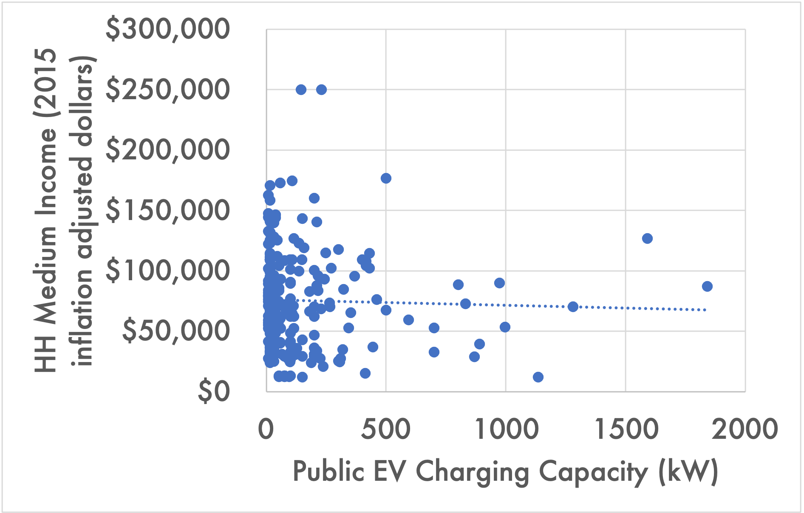
</figure>

  

<figure>
  <figcaption><b>Figure S3:</b> TAZ-level PEVCR Capacity over Time</figcaption>
  <figure>
    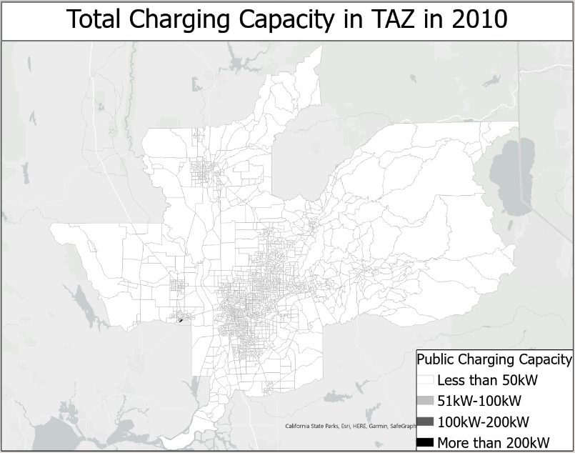
  </figure>
  <figure>
    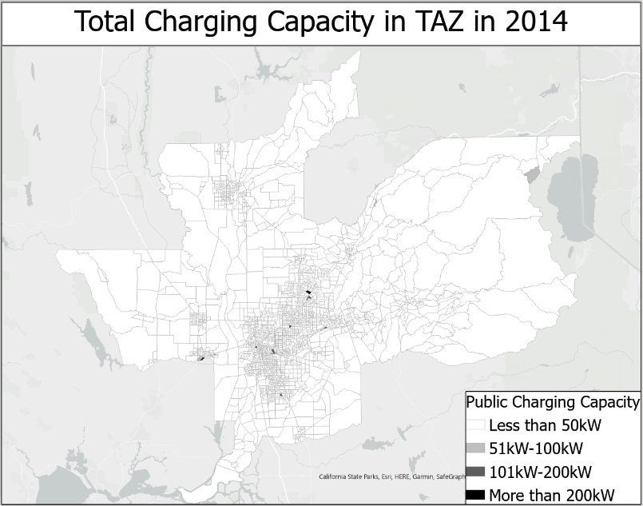
  </figure>
  <figure>
    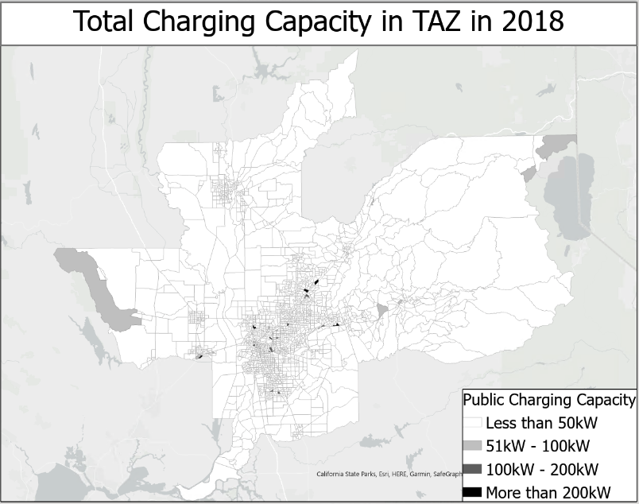
  </figure>
  <figure>
    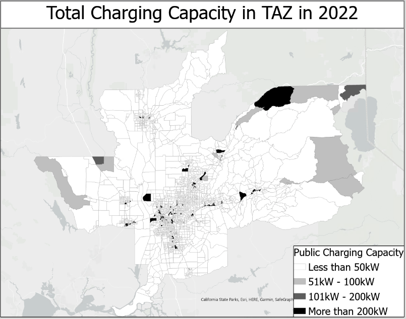
  </figure>
</figure>

  

<figure>
  <figcaption><b>Figure S4</b>: Dwelling Unit by Tenure by Community Type</figcaption>
  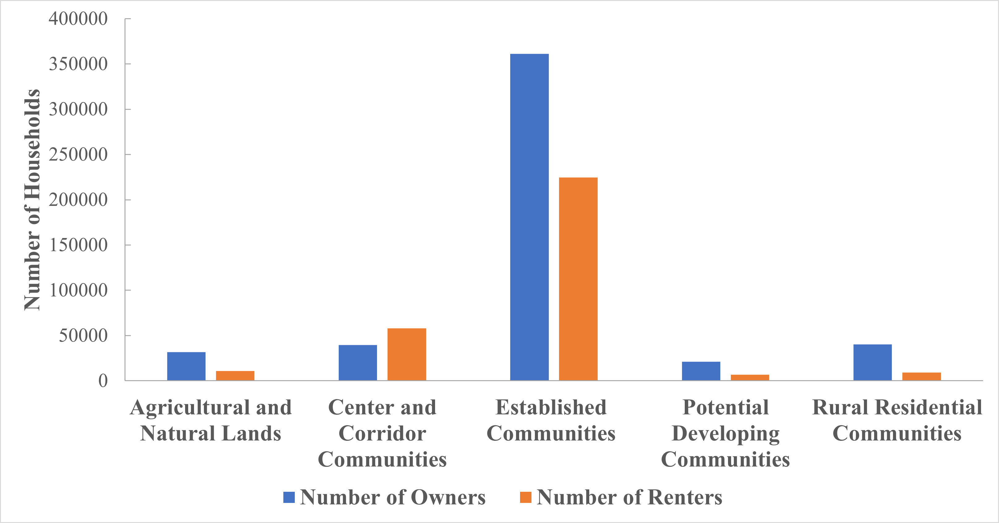
</figure>

  

<figure>
  <figcaption><b>Figure S5</b>: PG&E Service Division in SACOG Region</figcaption>
  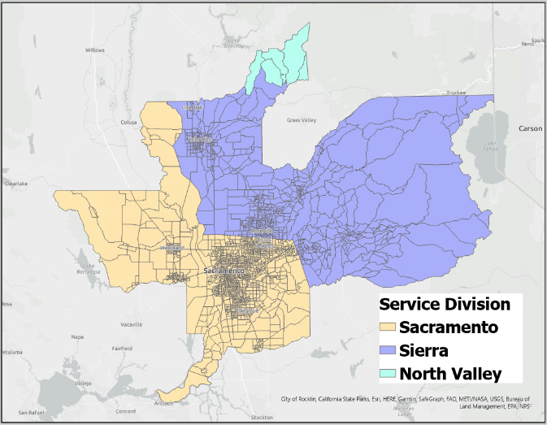
</figure>

  

<figure>
  <figcaption><b>Figure S6</b>: PG&E Reliability Indeces in Sacramento Service Division</figcaption>
  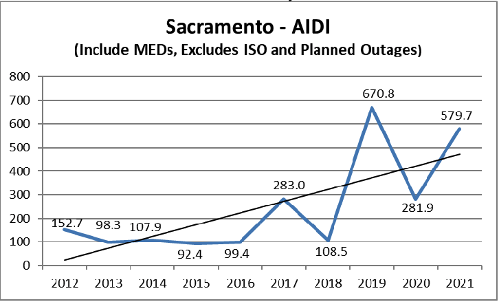
  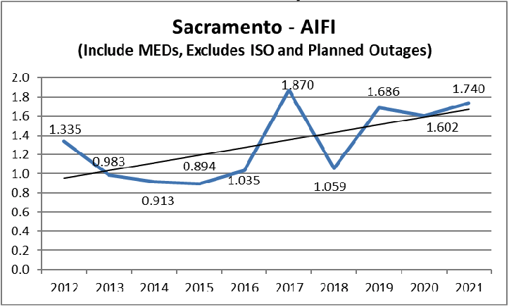
  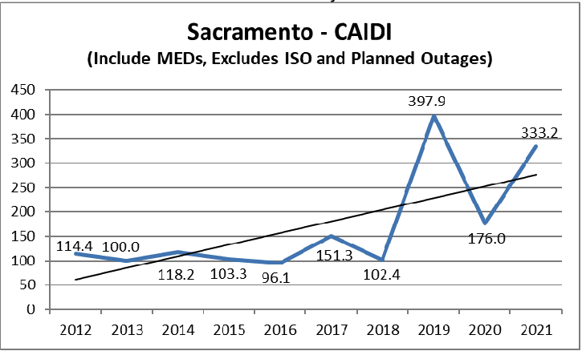
</figure>

  

<figure>
  <figcaption><b>Figure S7</b>: PG&E Reliability Indeces in Sierra Service Division</figcaption>
  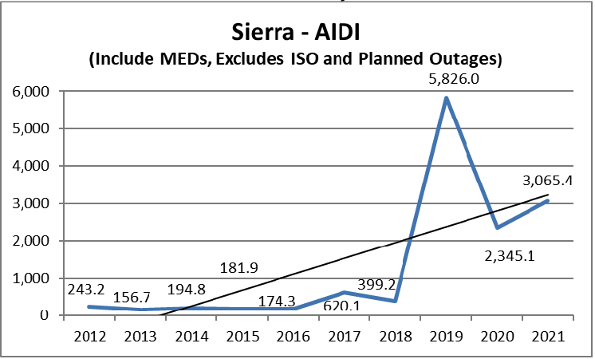
  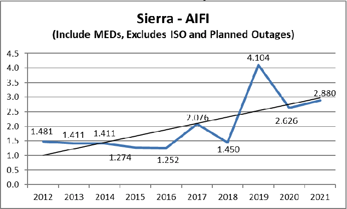
  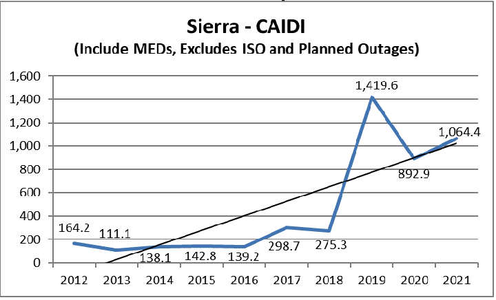
</figure>

  

<figure>
  <figcaption><b>Figure S8</b>: PG&E Reliability Indeces in North Valley Service Division</figcaption>
  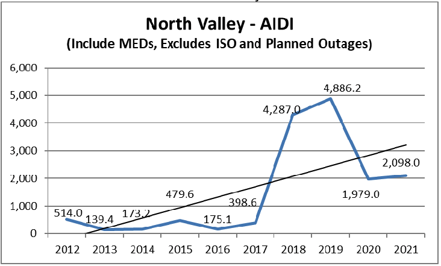
  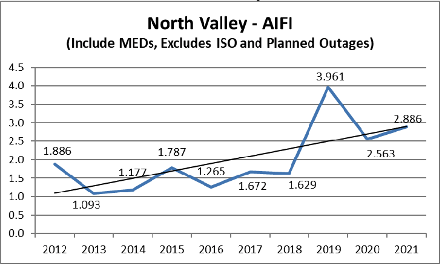
  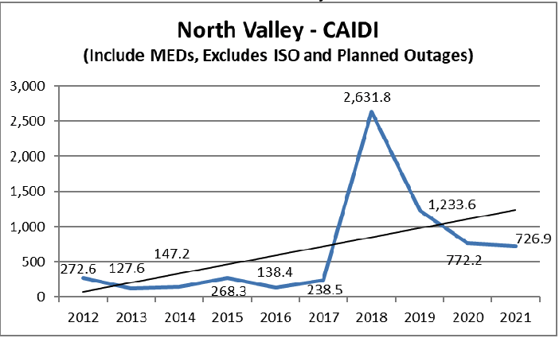
</figure>

  

<figure>
  <figcaption><b>Figure S9</b>: Avg. AIDI by Community Type and Median Income</figcaption>
  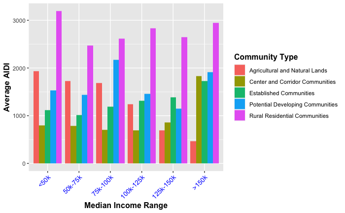
</figure>

  

<figure>
  <figcaption><b>Figure S10</b>: Histogram of Major Power Outrage Event Duration</figcaption>
  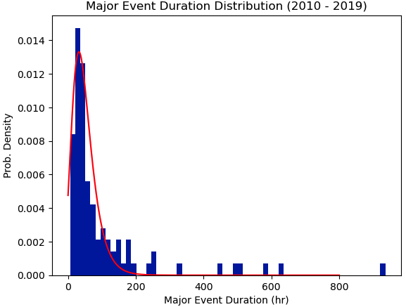
</figure>

**Table S11: Access to EV Charging Stations by Housing Type**
| Housing Type                 | Existing Access With 120V Perception | Existing Access | Potential Access | Existing Access with Parking Behavior Modification | Potential Access with Parking Behavior Modification |
|------------------------------|--------------------------------------|-----------------|------------------|----------------------------------------------------|----------------------------------------------------|
| SFH Detached, Owned          | 14%                                  | 33%             | 49%              | 70%                                                | 86%                                                |
| SFH Detached, Rented         | 10%                                  | 23%             | 40%              | 56%                                                | 75%                                                |
| SFH Attached, Owned          | 12%                                  | 30%             | 45%              | 53%                                                | 73%                                                |
| SFH Attached, Rented         | 12%                                  | 23%             | 41%              | 46%                                                | 68%                                                |
| SFH Combined                 | 13%                                  | 29%             | 46%              | 61%                                                | 79%                                                |
| High-Rise Apartment; Rented  | 6%                                   | 12%             | 21%              | 17%                                                | 26%                                                |
| Mid-Rise Apartment; Rented   | 4%                                   | 22%             | 32%              | 28%                                                | 40%                                                |
| Low-Rise Apartment; Rented   | 5%                                   | 14%             | 26%              | 20%                                                | 37%                                                |
| MFH Combined                 | 5%                                   | 16%             | 26%              | 21%                                                | 33%                                                |
| All                          | 11%                                  | 25%             | 40%              | 50%                                                | 66%                                                |
